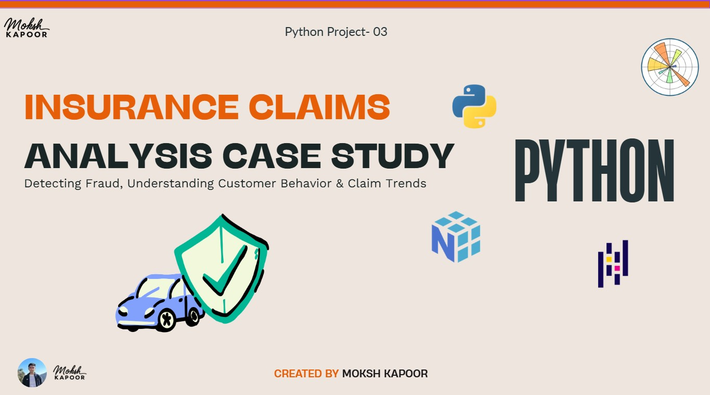

# 🛡️ Insurance Claims Analysis (Python)

A comprehensive Python-based insurance analytics project focused on understanding customer claim behavior, fraud patterns, claim trends, and business risk using Exploratory Data Analysis (EDA) and visualization techniques.

This project transforms raw insurance customer and claims data into actionable business insights using Python libraries such as Pandas, NumPy, Matplotlib, and Seaborn.

---

## 📊 Project Preview

### 🎥 Workings of Insurance Claims Analysis Project  

📌 Click on the image to see the working of this project as a presentation  


<a href="https://www.linkedin.com/posts/moksh-kapoor-618495322_insurance-claims-analysis-python-p-03-moksh-ugcPost-7457753541303083008-gprg?utm_source=share&utm_medium=member_desktop&rcm=ACoAAFGVzjQBQzKnpNzkuOZayyyvYW4FkHnrf28">
  
</a>

---

## 📘 Python Notebook

⚠️ GitHub does not preview exported `.html` notebook files directly.

To view the complete interactive notebook:

1. Open the `notebooks` folder  
2. Download the HTML notebook file *(contains complete workings & analysis)*  
3. Open it in your browser

📂 Notebook Folder: [Open Here](notebooks/)

---

# 📁 Dataset Overview

This project analyzes insurance customer and claims data to understand claim behavior, fraud patterns, and operational risk.

The dataset was created by merging multiple datasets containing:

- Customer demographics
- Policy details
- Claim information
- Incident causes
- Fraud indicators
- Police report status
- Regional and state-level information

The final merged dataset (`Cust_Claims`) was used for complete analysis and risk evaluation.

---

# 🎯 Business Problem & Analysis

The main objective of this project is to understand:

- How customers file insurance claims
- Which customer segments show higher claim frequency
- Which states and demographics contribute most to claims
- How fraud and unverified claims impact business risk
- Identification of suspicious and high-risk customers
- Seasonal and monthly claim trends

The analysis helps insurance companies improve:

- Fraud detection
- Risk management
- Claim verification processes
- Customer segmentation
- Operational efficiency

---

# 🧹 Data Preparation & Cleaning

Data cleaning and preprocessing were performed using Python.

## ✔ Data Cleaning

- Converted claim amount from object to numeric format
- Removed `$` symbols from claim amount
- Handled missing values using mean/mode imputation
- Removed duplicate customers while retaining latest claim records
- Validated numerical and categorical fields
- Corrected inconsistent data types

## ✔ Data Merging

- Combined customer and claims datasets using Customer ID
- Used inner joins to retain valid claim records
- Created final dataset: `Cust_Claims`

## ✔ Exploratory Data Analysis (EDA)

- Distribution analysis using histograms
- Incident category analysis using bar charts
- Outlier detection using boxplots
- Monthly claims trend analysis
- Fraud-focused exploratory analysis

---

# 📈 KPI Overview

| KPI | Value |
|------|------|
| Total Customers | 1078 |
| Total Claims | 1078 |
| Total Claim Amount | ₹1.34 Cr |
| Average Claim Amount | ₹12,470 |
| Fraud Claims | 247 |
| Alert Flag Claims | 295 |
| Fraud Percentage | 22.91% |

---

# 📊 Key Insights & Findings

## 🚗 Incident & Claim Insights

- Driver-related incidents contribute significantly to overall claims
- Injury-related claims without police reports indicate higher risk
- Certain claim categories dominate total claim value

## 👥 Customer Behavior Insights

- Specific age groups show higher claim frequency
- Claim behavior varies across customer segments and gender
- Some customer groups exhibit repeated suspicious patterns

## 📍 Geographic Insights

- Certain states dominate total claim volume
- Indicates regional concentration of insurance risk
- Geographic claim distribution is uneven across locations

## 🚨 Fraud Analysis

- Fraud cases are concentrated in specific customer age groups
- Missing or unknown police reports indicate suspicious activity
- Alert flag claims represent potential operational risk

## 📅 Time-Based Trends

- Claims fluctuate monthly with visible seasonality
- Certain periods record significantly higher claim volume
- Seasonal trends influence fraud and claim activity

---

# 🛠 Tools & Technologies Used

- Python
- Pandas
- NumPy
- Matplotlib
- Seaborn
- Exploratory Data Analysis (EDA)
- Data Cleaning & Transformation
- Data Visualization

---

# 📌 Key Learnings

- Fraud detection plays a critical role in insurance profitability
- Claim behavior differs across demographics and regions
- Missing verification signals can indicate suspicious claims
- Seasonal claim patterns influence operational planning
- Python enables scalable insurance risk analytics workflows

---

# ⚡ Recommendations

- Strengthen fraud detection and verification systems
- Focus monitoring on high-risk customer segments
- Improve police report validation processes
- Use regional claim analysis for better risk assessment
- Monitor seasonal claim spikes proactively

---

# 📂 Repository Structure

```bash
insurance-claims-analysis/
│
├── Images/
│   ├── insurance.jpg
│
├── notebooks/
│   ├── Insurance Claims Analysis ~ Moksh Kapoor.html
│
├── customer.csv
├── claims.csv
│
└── README.md
```

---

# 👤 Author

**Moksh Kapoor**  
Aspiring Data Analyst  

<p>
  🔗 <strong>LinkedIn:</strong> 
  <a href="https://www.linkedin.com/in/moksh-kapoor-618495322/" target="_blank">
    Visit My LinkedIn Profile
  </a>
</p>

📢 You can also check this project on my LinkedIn post:


<a href="YOUR_LINKEDIN_POST_LINK" target="_blank">
View Post 🚀
</a>
